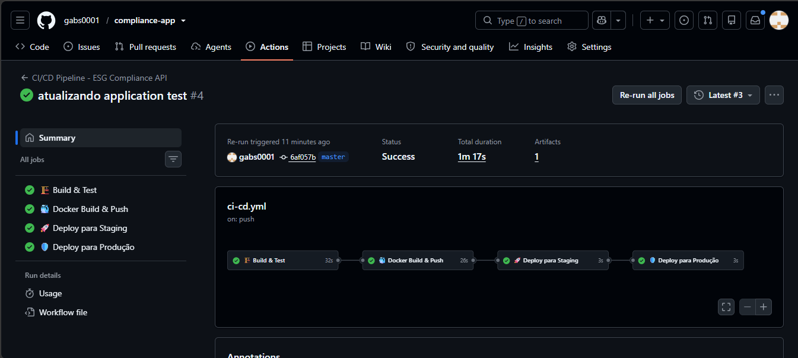
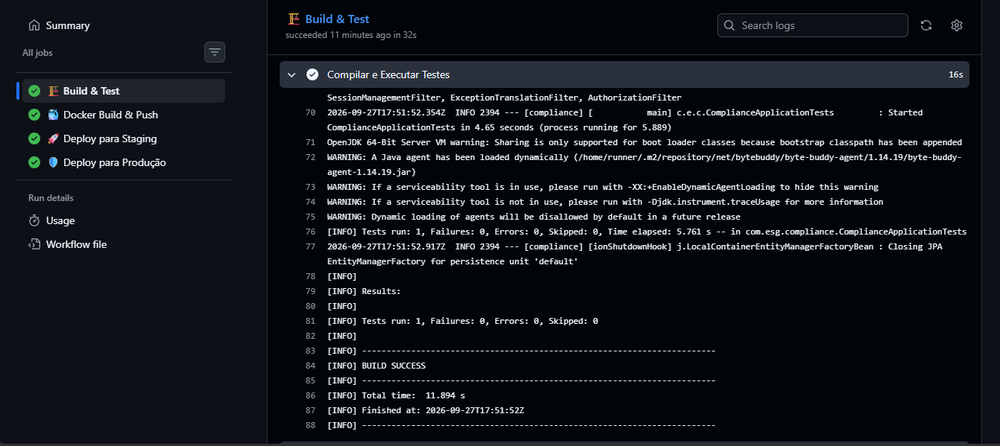
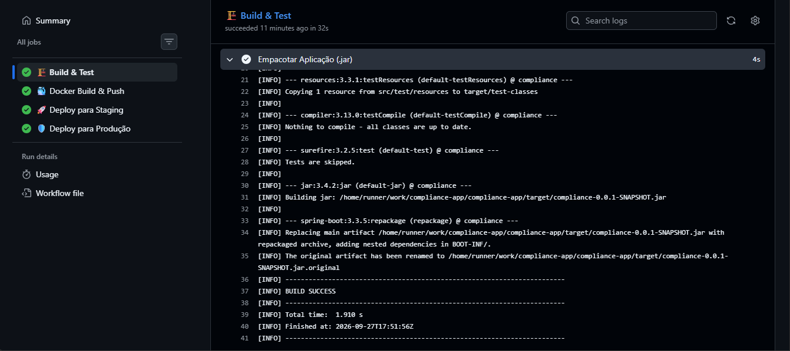
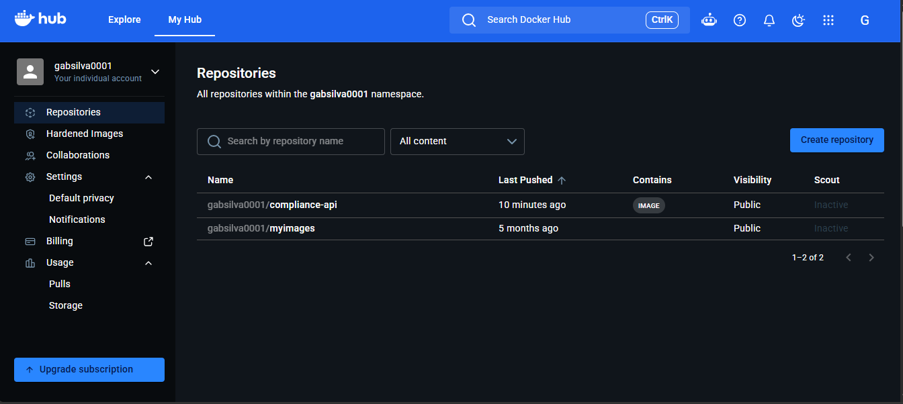
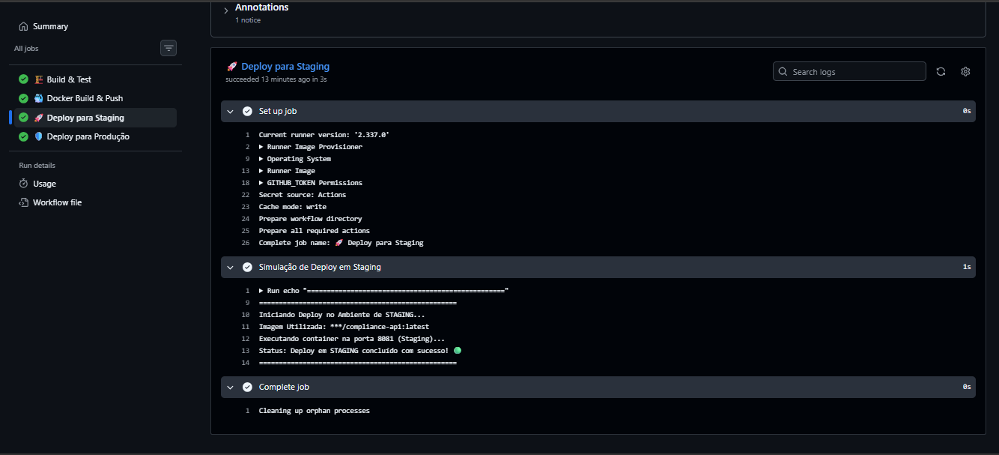
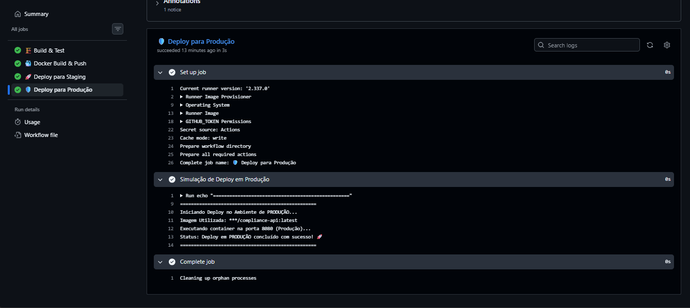

---
# ESG Compliance API 🌱

API RESTful desenvolvida com Java e Spring Boot com foco em **Governança e Compliance Ambiental (ESG)**.

O sistema permite o gerenciamento de empresas, emissões de carbono, licenças ambientais, auditorias e alertas, garantindo controle e rastreabilidade de conformidade ambiental.

---

## 🚀 Tecnologias Utilizadas

- Java 21
- Spring Boot
- Spring Security (JWT)
- Spring Data JPA
- Flyway (migrações)
- Oracle Database
- Docker & Docker Compose
- Maven

---

## 📌 Funcionalidades

- Cadastro e gerenciamento de empresas
- Registro de emissões de carbono
- Controle de licenças ambientais
- Auditorias ambientais
- Consulta de alertas ambientais
- Autenticação e autorização com JWT

---

## 🔐 Autenticação

A API utiliza autenticação baseada em **JWT (JSON Web Token)**.

### Fluxo:

1. Criar usuário:
```http
POST /auth/register
````

2. Realizar login:

```http
POST /auth/login
```

3. Utilizar token nas requisições:

```http
Authorization: Bearer <token>
```

---

## 📂 Estrutura de Endpoints

### 🔐 Auth

* `POST /auth/register`
* `POST /auth/login`

---

### 🏢 Companies

* `POST /companies`
* `GET /companies`
* `GET /companies/{id}`
* `PATCH /companies/{id}/name`
* `DELETE /companies/{id}`

---

### 🌱 Carbon Emissions

* `POST /emissions`
* `GET /emissions`
* `GET /emissions/{id}`
* `DELETE /emissions/{id}`

---

### 📄 Environmental Licenses

* `POST /licenses`
* `GET /licenses`
* `GET /licenses/{id}`
* `PATCH /licenses/{id}/expiration`
* `DELETE /licenses/{id}`

---

### 🧪 Audits

* `POST /audits`
* `GET /audits`
* `GET /audits/{id}`
* `PATCH /audits/{id}/notes`
* `DELETE /audits/{id}`

---

### 🚨 Alerts (read-only)

* `GET /alerts`
* `GET /alerts/{id}`

---

## ⚙️ Configuração do Ambiente

### 1. Criar arquivo `.env`

Baseie-se no arquivo `.env.example`:

```env
ORACLE_USER=your_user
ORACLE_PASSWORD=your_password
JWT_SECRET=your_secret
```

---

### 2. Banco de Dados

Certifique-se de que o Oracle esteja rodando localmente na porta padrão:

```
localhost:1521/XE
```

---

## 🐳 Executando com Docker

### 1. Gerar o build

```bash
mvn clean package -DskipTests
```

---

### 2. Subir aplicação

```bash
docker-compose up --build
```

---

### 3. Acessar API

```
http://localhost:8080/api
```

---

## 🧪 Testes com Postman

A collection do Postman está incluída no projeto.

### Fluxo recomendado:

1. Register
2. Login (token automático)
3. Criar Company
4. Criar Emission
5. Criar License
6. Criar Audit
7. Consultar dados
8. Atualizar dados
9. Deletar dados

---

## 🧠 Arquitetura

O projeto segue uma abordagem em camadas:

```
api → controllers, dtos
domain → entidades, regras de negócio
repository → acesso a dados
service → orquestração
security → autenticação e autorização
```

---

#### Prints do funcionamento

Abaixo estão apresentadas as evidências de execução do ciclo de vida da aplicação e a automação de CI/CD utilizando o GitHub Actions e o Docker Hub:

##### 1. Pipeline CI/CD Completo (Build, Test, Push e Deploys)
Execução do workflow no GitHub Actions exibindo os 4 jobs integrados e executados com sucesso:


##### 2. Compilação e Execução de Testes Automatizados (Maven)
Logs do job `Build & Test` detalhando a execução do `mvn test` e empacotamento do artefato `.jar` sem falhas:



##### 3. Containerização e Publicação no Docker Hub
Imagem Docker da aplicação (`compliance-api`) construída e publicada automaticamente com as tags `latest` e o SHA do commit:


##### 4. Deploy Automatizado nos Ambientes de Staging e Produção
Logs comprovando o acionamento e o deploy contínuo nos ambientes segregados de Staging e Produção:



---

## 📌 Boas práticas aplicadas

* Uso de DTOs com records
* Encapsulamento de regras no domínio
* Validação com Bean Validation
* Tratamento centralizado de exceções
* Migração de banco com Flyway
* Segurança com JWT
* Containerização com Docker

---

## 📈 Possíveis melhorias

* Implementação de roles/perfis de usuário
* Integração com serviços externos (ex: APIs ambientais)
* Monitoramento com Spring Actuator
* Deploy em nuvem (AWS, Azure, etc.)

---

## 👨‍💻 Autor

Gabriel Luiz

---

## 📄 Licença

Este projeto é acadêmico e utilizado para fins educacionais.